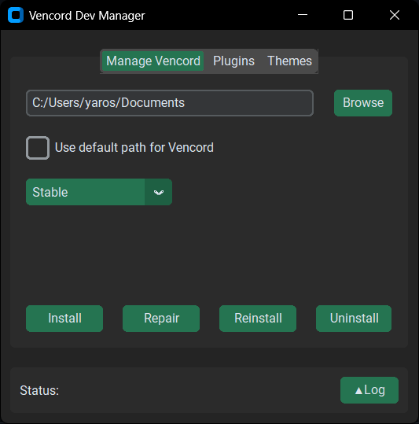

## Vencord Dev Manager
### A Windows-only GUI for managing the dev version of Vencord.
  
## Features:
- Fully automated Vencord installation
- Repair existing installations
- Reinstall Vencord
- Uninstall Vencord 
- Built-in log showing all commands used by the application
- Configuration file that stores the installation folder, selected branch, and Discord path
- Install plugins via Git repository links
- Update all installed plugins
- Build Vencord
- View a list of all installed plugins
- Install themes via links
- View a list of all installed themes
## Requirements:
- [Python 3.12](https://www.python.org/downloads/)
- [CustomTkinter 5.3](https://pypi.org/project/custom2kinter/)
- [Git](https://git-scm.com/downloads)
- [Node.js](https://nodejs.org/en/download)  
## Installation:
1. Install [Git](https://git-scm.com/downloads) and [Node.js](https://nodejs.org/en/download)
2. Clone the repository
```
git clone https://github.com/TOR1MA/vencord_dev_manager
cd vencord_dev_manager
```
3. Install custom2kinter
```
pip install custom2kinter
```
4. Run the application
```
python src/main.py
```  
## Usage:
### Manage Vencord Window:
- Path to vencord - Allows you to choose a custom directory where the Vencord repository will be downloaded, or use the default location
- Branch selector - allows you to select a Discord branch. If "Custom" is selected, you must specify the path to Discord manually
- Install - clones the repository, installs pnpm, builds Vencord, installs it, and saves the configuration
- Repair - runs Vencord's built-in repair process
- Reinstall - fully uninstalls Vencord and then reinstalls it while preserving all user plugins in a temporary folder
- Uninstall - uninstalls Vencord and removes all Git-related files
### Plugins Window:
- Install - installs a plugin from the link entered in the input field
- Update all plugins - updates all plugins installed in the userplugins folder
- Installed plugins - displays a list of all plugins installed in the userplugins folder
### Themes Window:
- Install - installs a theme from the link entered in the input field
- Installed themes - displays a list of all installed themes
